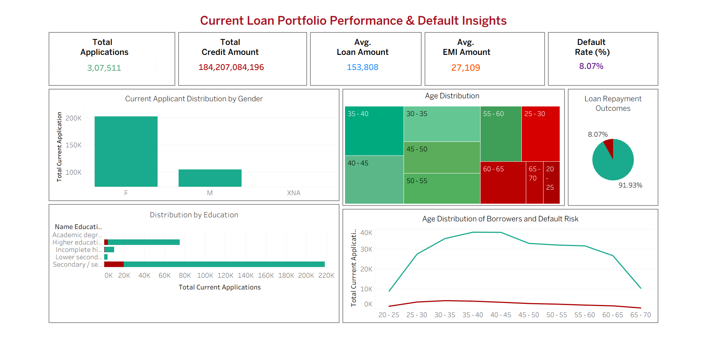
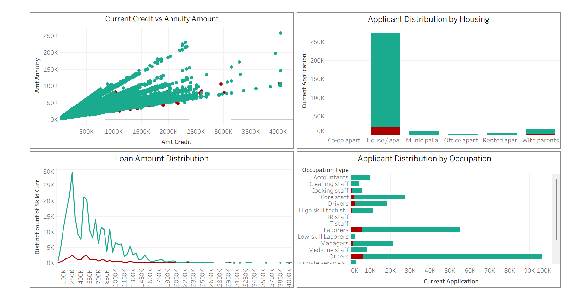
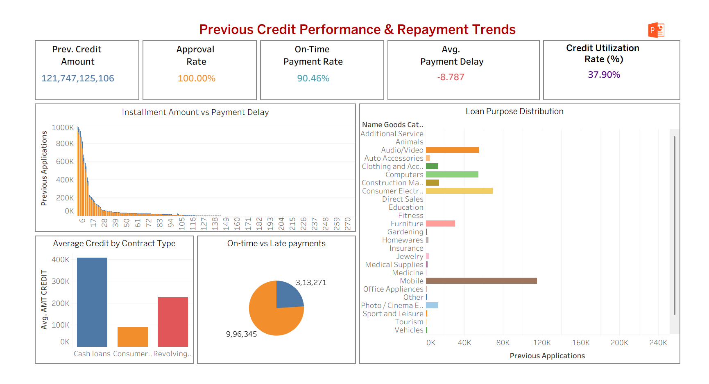

# 📊 End-to-End Loan Lifecycle Analysis

### 🔗 Project by [Gulnaaz Ali](https://www.linkedin.com/in/gulnaaz-data-analyst)  

---

## 📌 Project Overview
Financial institutions face challenges in managing loan portfolios and assessing borrower risk. This project provides a **360° analysis of the loan lifecycle** — from applications and borrower demographics to repayment patterns and default risks.  

Using interactive dashboards and integrated datasets, the project highlights **borrower behavior, credit performance, repayment delays, and default hotspots**, enabling **data-driven decision-making** for risk mitigation and profitability.

---

## 🎯 Objectives
- Build a **360° Customer View** by analyzing demographics, loan applications, and financial history.  
- Assess **borrower credibility** using past repayment behavior.  
- Monitor **loan repayment trends** to detect delays and defaults.  
- Identify **high-risk borrower groups** for early intervention.  
- Provide **strategic recommendations** for financial institutions.  

---

## 📊 Dashboards

### 🔹 Current Loan Portfolio Performance & Default Insights

### 🔹 Loan Distribution & Borrower Segmentation

### 🔹 Previous Credit Performance & Repayment Trends

---

## 🔍 Key Insights
- **Applications:** 3+ lakh borrowers, total credit exposure of ₹184 billion.  
- **Default Rate:** ~8.07% overall; higher among <30 and >60 age groups.  
- **Education Impact:** Borrowers with lower education show higher default risk.  
- **Occupation:** Laborers, core staff, and “others” drive defaults; IT staff & managers are safer segments.  
- **Loan Size:** Most loans fall within ₹100K–₹500K range, also where defaults concentrate.  
- **Previous Credit:** ₹121B in prior credit with 90.46% on-time repayment rate.  
- **Loan Purpose:** Mobile & consumer durables show higher risk of defaults.  

---

## 🚀 Recommendations
- **Tighten credit checks** for younger (<30) and older (>60) borrowers.  
- **Implement financial literacy programs** for low-education applicants.  
- **Reassess risk pricing** for loans tied to high-default categories (e.g., mobile, furniture, consumer durables).  
- **Incentivize timely repayments** via cashback or lower interest for consistent payers.  
- **Monitor outliers** with unusually high annuity-to-credit ratios.  
- **Leverage unused credit capacity** (37.9% utilization) for cross-selling to reliable customers.  

  

---

## 📈 Business Impact
✅ Reduced default risks through targeted risk assessment.  
✅ Improved profitability by focusing on reliable borrower segments.  
✅ Smarter product strategy with data-driven insights.  
✅ Stronger portfolio stability and growth opportunities.  

---

🔗 *Connect with me:* [LinkedIn](https://www.linkedin.com/in/gulnaaz-data-analyst) | [GitHub](https://github.com/gulnaaz-data-analyst)
